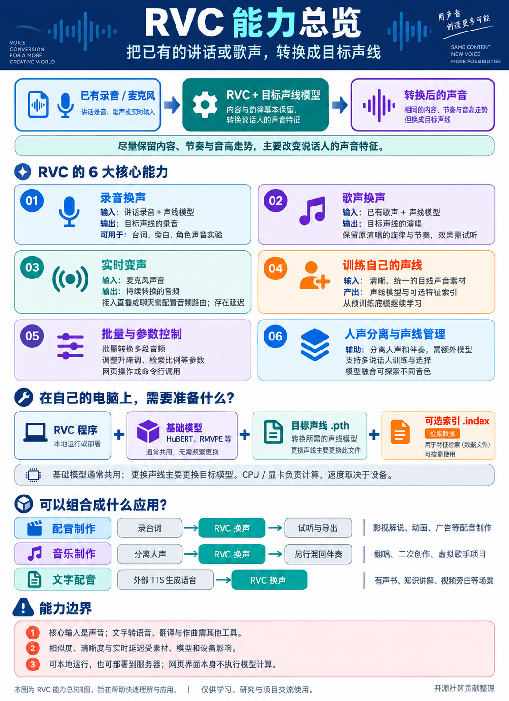
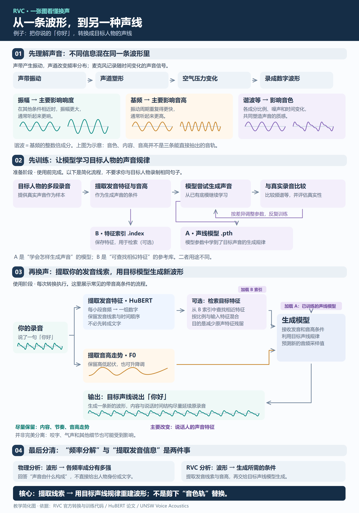
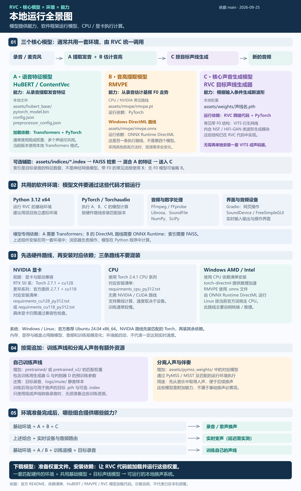
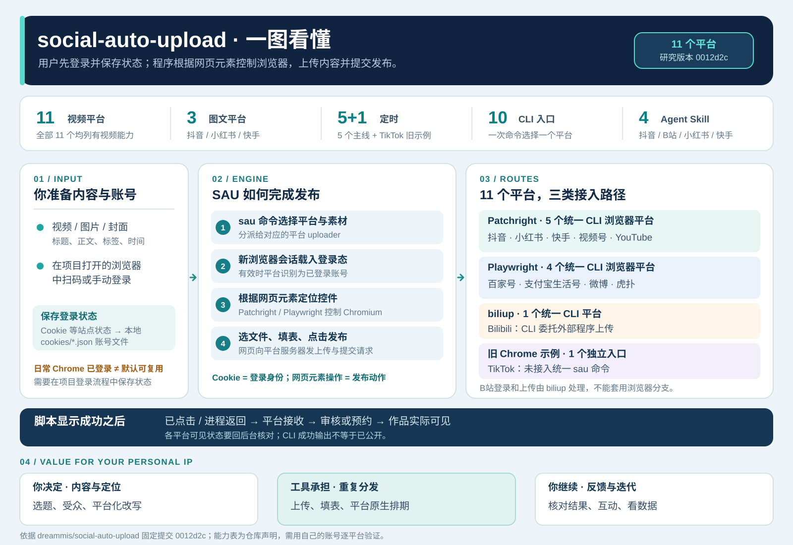
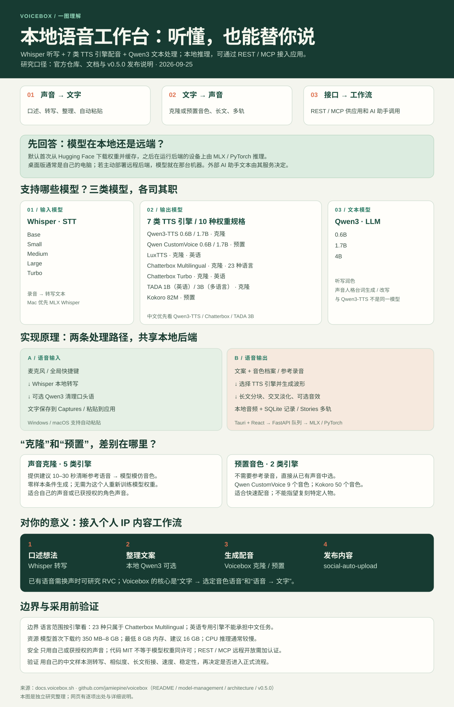
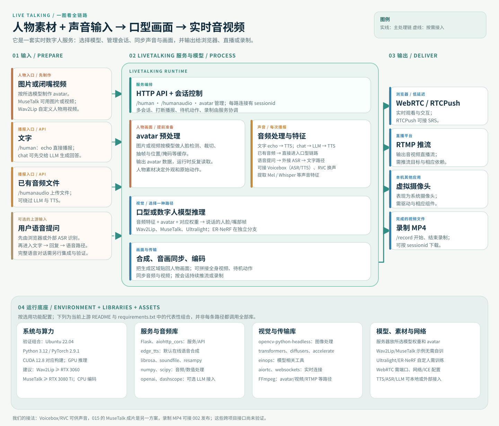
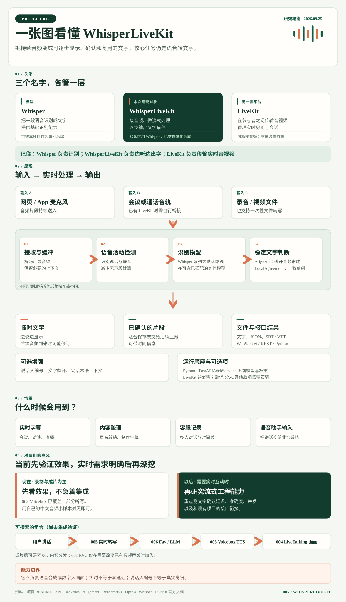
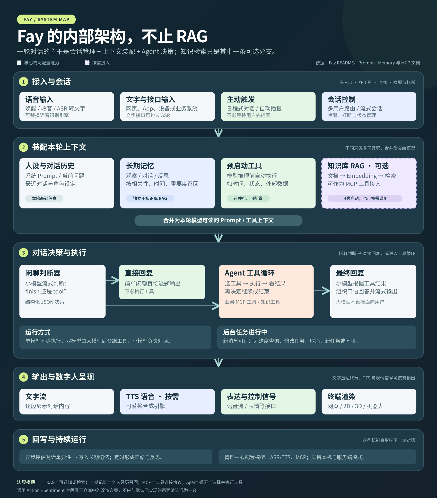
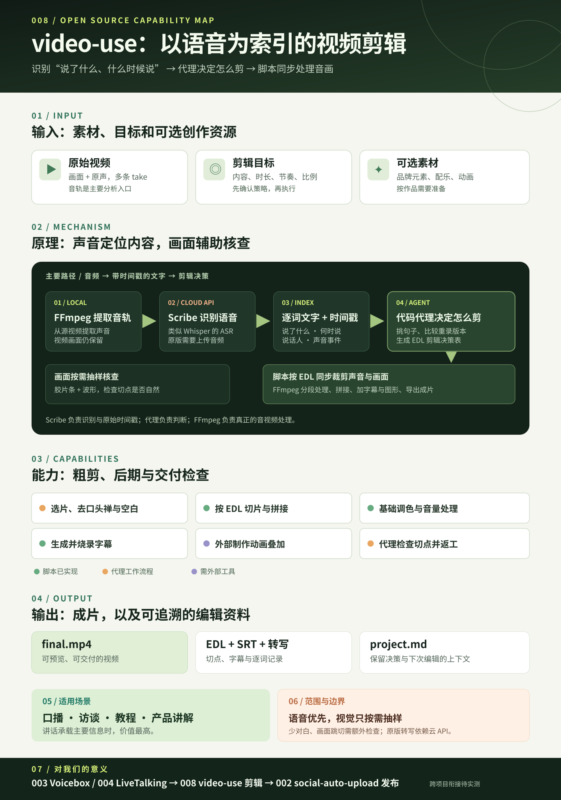
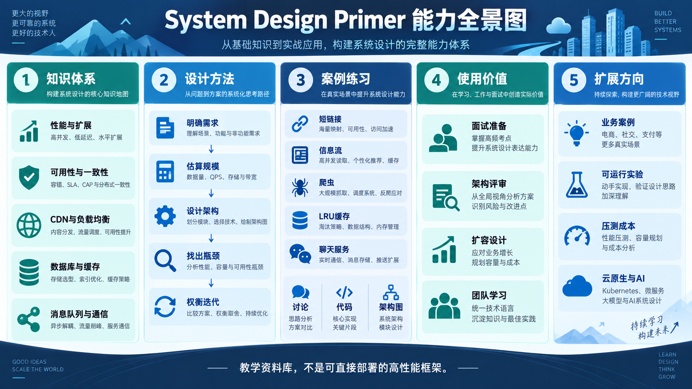

# GitHub 项目研究

这里按顺序记录值得深入研究的 GitHub 项目。每个子项目保留原仓库链接、简要介绍、关键发现、图片说明和实践记录；有可展示的静态网页时，也会附上演示入口。

[访问在线研究索引](https://yydshly.github.io/0925_codex_project/)

## 项目索引

编号按收录顺序递增，并与 projects/ 中的目录名一致。已有编号不复用。

| 编号 | 源库（关联原仓库） | 研究摘要 | 阅读入口 |
| :--: | --- | --- | --- |
| 001 | [Retrieval-based-Voice-Conversion-WebUI](https://github.com/RVC-Project/Retrieval-based-Voice-Conversion-WebUI) | **能力：** 已有语音 / 歌声换声、实时变声与声线训练。**原理：** 提取发音与音高，由目标模型重建波形，并可用检索辅助。**对我的意义：** 可复用为换声模块；先理解方案，实际效果按需验证。 | [完整研究](projects/001-rvc-voice-conversion/README.md) · [查看网页](https://yydshly.github.io/0925_codex_project/projects/001-rvc-voice-conversion/) |
| 002 | [social-auto-upload](https://github.com/dreammis/social-auto-upload) | **能力：** 11 个平台列有视频上传能力，抖音、小红书、快手还支持图文。**原理：** 用户先登录并保存状态；9 个平台由 Patchright / Playwright 根据网页元素操作创作者后台，B站委托 biliup，TikTok 为旧示例。**对我的意义：** 内容做好后可减少个人 IP 多平台重复上传与排期。 | [完整研究](projects/002-social-auto-upload/README.md) · [在线网页](https://yydshly.github.io/0925_codex_project/projects/002-social-auto-upload/) · [一图总览](https://yydshly.github.io/0925_codex_project/projects/002-social-auto-upload/overview.svg) |
| 003 | [Voicebox](https://github.com/jamiepine/voicebox) | **能力：** 本地 Whisper 听写、7 类 TTS 引擎的克隆或预置音色配音、本地 Qwen3 文本整理，并通过 REST/MCP 接入应用。**原理：** 首次下载模型后，由本地 FastAPI 调度 MLX/PyTorch 推理；参考录音只为克隆提供音色条件。**对我的意义：** 可放在个人 IP 的口述与配音环节，衔接换声与发布工具。 | [完整研究](projects/003-voicebox/README.md) · [在线网页](https://yydshly.github.io/0925_codex_project/projects/003-voicebox/) · [完整引导图](https://yydshly.github.io/0925_codex_project/projects/003-voicebox/overview.svg) |
| 004 | [LiveTalking](https://github.com/lipku/LiveTalking) | **能力：** 图片或视频制作人物 avatar，文字或音频驱动口型，输出实时流或 MP4。**原理：** 音频特征驱动 Wav2Lip、MuseTalk 等模型生成面部画面，再贴回人物素材并同步声音。**场景：** 讲解、客服、直播和短视频。**对我的意义：** 在此前 MuseTalk 成片练习上，按需验证实时会话与推流。 | [在线网页](https://yydshly.github.io/0925_codex_project/projects/004-livetalking/) · [完整引导图](https://yydshly.github.io/0925_codex_project/projects/004-livetalking/assets/architecture.svg) · [完整研究](projects/004-livetalking/README.md) |
| 005 | [WhisperLiveKit](https://github.com/QuentinFuxa/WhisperLiveKit) | **能力：** 音频实时转写，输出临时与已确认文字；可选字幕、翻译、说话人区分。**原理：** VAD 检测语音，Whisper 等模型识别，流式策略确认稳定文字并推送。**场景：** 直播/会议字幕、访谈、语音助手输入。**底层依赖：** Python Web 服务、音频组件、识别模型及权重；LiveKit 非必需。**对我的意义：** 当前录制成片先复用 003 Voicebox，试效果即可；有实时互动需求再研究延迟与集成。 | [完整研究](projects/005-whisperlivekit/README.md) · [在线网页](https://yydshly.github.io/0925_codex_project/projects/005-whisperlivekit/) · [我们生成的引导图](https://yydshly.github.io/0925_codex_project/projects/005-whisperlivekit/assets/overview.svg) |
| 006 | [Fay](https://github.com/xszyou/Fay) | **能力：** 接收语音与文字，管理会话、长期记忆和主动播报，按需查询知识或调用 MCP 业务工具，输出文字、语音与终端信号。**本质：** 面向数字人等终端的 Agent 交互编排框架；人物画面由终端渲染，RAG 是可选知识分支。**场景：** 导览、教学、客服、虚拟主播和语音硬件。**对我的意义：** 可串联 005 实时转写与 004 数字人画面；先跑通最小闭环，再验证延迟和接口。 | [完整研究](projects/006-fay/README.md) · [在线网页](https://yydshly.github.io/0925_codex_project/projects/006-fay/) · [摘要架构图](https://yydshly.github.io/0925_codex_project/projects/006-fay/assets/fay-internal-architecture.svg) |
| 007 | [Calibre-Web](https://github.com/janeczku/calibre-web) | **定位与能力：** 自托管图书管理库，接入已有 Calibre 藏书，提供编目、查找、阅读、下载、OPDS 与 Kobo 供书；软件本身不附带书籍。**场景：** 个人藏书、家庭共读、阅读器供书和内容创作资料管理。**对我的意义：** 给现有内容创作项目补上长期资料入口；正文检索与 AI 问答仍需另建。 | [在线网页](https://yydshly.github.io/0925_codex_project/projects/007-calibre-web/) · [我们生成的引导图](https://yydshly.github.io/0925_codex_project/projects/007-calibre-web/assets/overview.svg) · [完整研究](projects/007-calibre-web/README.md) |
| 008 | [video-use](https://github.com/browser-use/video-use) | **能力：** 逐词转写辅助选段，按 EDL 粗剪、调色、叠加动画、加字幕并渲染。**原理：** Scribe 识别音频与时间戳，代码代理理解文本并生成 EDL，FFmpeg 同步剪辑音画。**隐患：** 时间对齐不保证画面连续，切点可能跳变；原版转写依赖云 API。**场景：** 口播、访谈、教程、产品讲解。**对我的意义：** 有望衔接 Voicebox / LiveTalking 素材与 social-auto-upload 发布；中文和 Windows 效果待实测。 | [完整研究](projects/008-video-use/README.md) · [能力网页（部署后）](https://yydshly.github.io/0925_codex_project/projects/008-video-use/) |
| 009 | [system-design-primer](https://github.com/donnemartin/system-design-primer) | **定位与能力：** 高性能与大规模系统设计资料库，涵盖性能、扩展、可用性、一致性、缓存、数据库等主题，以及设计方法、案例练习和 Anki 卡片。**对我的意义：** 为现有项目的并发、延迟与扩容讨论提供知识索引和提问清单；它不是可直接部署的框架。 | [摘要笔记](projects/009-system-design-primer/README.md) · [查看引导图](docs/projects/009-system-design-primer/assets/overview.png) · [网页导读](https://yydshly.github.io/0925_codex_project/#guide-system-design-primer) |
| 010 | [Jellyfish](https://github.com/Forget-C/Jellyfish) | **定位：** 以分章剧本为入口的 AI 短剧生产工作台。**能力：** 剧本拆镜头与要素提取、导演分镜提示、人物和场景资产复用、人工确认、图片与视频生成任务追踪。**出口：** 分镜与提示词、图片、单镜头视频及可追溯素材。**对我的意义：** 可补上系列内容从剧本到镜头素材的生产环节；小说改编与完整成片仍需另行处理或实测。 | [完整研究](projects/010-jellyfish/README.md) · [在线导读](https://yydshly.github.io/0925_codex_project/projects/010-jellyfish/) · [完整引导图](https://yydshly.github.io/0925_codex_project/projects/010-jellyfish/assets/overview.svg) |

## 001 · Retrieval-based-Voice-Conversion-WebUI 图文导读

源库：[Retrieval-based-Voice-Conversion-WebUI](https://github.com/RVC-Project/Retrieval-based-Voice-Conversion-WebUI)。下面依次说明能力、实现原理、环境与使用意义，三张图分别配合对应文字阅读。

### 01 · 能力：把已有声音转换成目标声线

先用一个例子理解：你录下“今天的天气很好”，RVC 接收这段录音和目标声线模型，生成一段听起来具有目标音色的新录音。它也能处理歌声，尽量保留原来的歌词、节奏和旋律走向。

围绕这个核心能力，仓库提供离线转换、批量处理、实时变声和目标声线训练。人声分离等辅助工具可以先把歌曲中的人声与伴奏分开，再进行换声。

输入主要是声音，输出也是声音。它本身不负责从文字写出并朗读内容，也不自动完成翻译、作词或作曲；这些需求需要与其他工具组合。

**这一部分的理解：** 理解为“AI 换声工具”是合适的：它主要改变声音的身份特征，而转换效果仍取决于输入质量和目标模型。

能力图：先看输入和输出，再看围绕换声展开的功能与场景。

### 02 · 原理：提取线索，再生成目标音色的声音

声音是随时间变化的波形。振幅与响度相关，基频与音高相关；谐波的强弱分布、声道共振、气声噪声及其随时间的变化共同影响音色。它们相互关联，不能把人的声音简单看成三个互不影响的旋钮。

HuBERT 等特征模型从输入录音中提取与发音相关的线索；使用音高条件的模型还会通过 RMVPE 等方法估计音高轨迹。这里得到的是模型使用的数值特征，不是先把录音转成文字，也不是把“原来的音色”完整剥离出来。

目标声线模型把这些特征与音高作为条件，生成一段新的声音波形。可选的检索索引会在目标声音的特征库中寻找相似片段并融合特征，帮助减少来源音色的残留；它不是直接剪贴目标录音。

目标模型来自训练：用目标声线录音提取特征，让模型学习如何由特征还原这类声音，不断调整参数后保存为权重文件。使用现成且兼容的目标模型时，可以直接转换，无需重新训练。

**这一部分的理解：** 可以概括为“分析 → 条件化重建”：多个模型与算法协作，保留发音和韵律线索，重新合成具有目标音色的波形。

原理图：从声音基础读到训练，再沿转换流程理解各模块的输入和输出。

### 03 · 环境与意义：模型如何运行，什么时候值得尝试

软件环境负责让程序运行：Python、PyTorch、音频处理库、FFmpeg，以及与所选计算设备匹配的运行支持。浏览器中的 WebUI 是操作界面，实际计算由运行程序的电脑或服务器完成。

模型资源承担不同工作：HuBERT 等基础权重提取特征，RMVPE 权重用于所选音高提取方案，目标声线 .pth 文件决定要转换成的声音。部分音高算法不依赖额外神经网络模型，.index 则是可选的检索数据，并不是另一个生成模型。

这些资源通常由同一套程序加载，不需要为每个模型分别安装一个软件。转换前就要准备好所选流程必需的模型；训练用预训练权重、人声分离模型等，则随功能需求增加。整合包是否包含它们，需要检查具体版本。

对我而言，它既是可以复用的换声模块，也是理解“通用特征模型 + 目标声线训练 + 检索辅助”的实例。当前是能力探索，理解这些关系就能帮助判断用途；等出现明确场景，再实际验证声音相似度、清晰度、速度和设备开销。

**这一部分的理解：** 本地模型是一种运行方式，也可以放在服务器。现在发布的是研究网页；部署网页并不等于已经安装并运行 RVC。

环境图：区分运行环境、核心模型、目标声线文件和按功能增加的资源。

## 002 · social-auto-upload 图文导读

源库：[dreammis/social-auto-upload](https://github.com/dreammis/social-auto-upload)。仓库列出 11 个视频平台、3 个图文平台及部分平台的定时能力。抖音、小红书、快手、视频号、YouTube 通过 Patchright 操作创作者网页；百家号、支付宝生活号、微博、虎扑通过 Playwright 操作网页。Bilibili 由 biliup 处理，TikTok 是未接入统一 CLI 的旧 Chrome 示例。

**实现原理：** 用户在项目打开的浏览器中手动登录，程序把 Cookie 等状态保存到本地账号文件。下次发布时，它在新的浏览器会话恢复登录状态，按网页元素找到上传框、输入框和按钮，选择文件、填写内容并点击发布；浏览器中的平台网页向服务器发送请求。平台改版或登录状态失效时，需要维护脚本或重新登录。

**对我的意义：** 它适合放在个人 IP 的“内容完成 → 稳定分发”阶段。工具可承担重复上传、填表与排期；定位、选题、各平台表达和反馈复盘仍由自己掌握。统一 CLI 一次处理一个平台，多平台连续分发需在外层组织任务。

[查看在线能力地图](https://yydshly.github.io/0925_codex_project/projects/002-social-auto-upload/) · [打开完整引导图](https://yydshly.github.io/0925_codex_project/projects/002-social-auto-upload/overview.svg) · [阅读研究笔记](projects/002-social-auto-upload/README.md)

## 003 · Voicebox 能力导读

源库：[jamiepine/voicebox](https://github.com/jamiepine/voicebox)。Voicebox 把“语音 → 文字”和“文字 → 指定音色语音”放在同一套本地工作台中，还提供 REST/MCP 接口。它与 001 RVC 的“已有语音换声”不同，适合研究中文口述输入、自己的声音配音及 AI 助手发声；与 002 的多平台发布工具可组合成内容工作流。具体语言和克隆能力取决于所选引擎，实际音质与速度仍需在本机验证。

[查看在线能力地图](https://yydshly.github.io/0925_codex_project/projects/003-voicebox/) · [打开完整引导图](https://yydshly.github.io/0925_codex_project/projects/003-voicebox/overview.svg) · [阅读完整研究笔记](projects/003-voicebox/README.md)

## 004 · LiveTalking 能力导读

源库：[lipku/LiveTalking](https://github.com/lipku/LiveTalking)。

- **能力：** 用人物图片或闭嘴视频准备 avatar；文字经 TTS、已有音频可直接驱动人物说话，支持会话、打断、WebRTC/RTMP、虚拟摄像头与 MP4 录制。
- **底层原理：** 声音被提取为模型需要的特征，所选 Wav2Lip、MuseTalk 等模型生成对应口型或面部帧；服务把生成区域合成人物画面，再同步声音与视频并交付。
- **使用场景：** 网页数字人客服、课程或展厅讲解、虚拟主播、预先制作的短视频。
- **对我的意义：** 可把 Voicebox 配音或其他已有声音接成出镜形象；成片可再交给 002 发布工具。此前的 015 已用 MuseTalk 1.5 做过本地成片，004 值得研究的是会话和实时推流。

[查看在线网页](https://yydshly.github.io/0925_codex_project/projects/004-livetalking/) · [打开完整引导图](https://yydshly.github.io/0925_codex_project/projects/004-livetalking/assets/architecture.svg) · [阅读研究笔记](projects/004-livetalking/README.md) · [查看环境要求](projects/004-livetalking/docs/requirements.md)

目前完成的是资料研究和静态网页，尚未部署 LiveTalking 本体，也未验证跨项目接口。

## 005 · WhisperLiveKit 实时语音输入导读

源库：[QuentinFuxa/WhisperLiveKit](https://github.com/QuentinFuxa/WhisperLiveKit)。它把持续音频转换成可逐步显示和确认的文字，支持文件字幕、可选说话人区分与翻译。底层由 Python 服务接收音频，经 VAD、Whisper 等识别后端和流式确认策略输出结果；模型权重、音频组件及可选功能有相应依赖，LiveKit 平台并非必需。适用于直播/会议字幕、访谈记录和实时语音助手。当前若以录音、配音和成片为主，先试效果即可；有实时互动需求时，可接在用户讲话与 LLM / Voicebox / LiveTalking 之间。跨项目组合仍需实测。

[打开在线能力网页](https://yydshly.github.io/0925_codex_project/projects/005-whisperlivekit/) · [打开我们生成的一图总览](https://yydshly.github.io/0925_codex_project/projects/005-whisperlivekit/assets/overview.svg) · [阅读完整研究笔记](projects/005-whisperlivekit/README.md)

## 006 · Fay 数字人交互与业务连接导读

源库：[xszyou/Fay](https://github.com/xszyou/Fay)。

**能力：** 接收文字和语音，管理会话、长期记忆与主动播报，按需查询知识或调用 MCP 业务工具，再把回复送往数字人等终端。**本质：** 一个 Agent 交互编排框架；RAG 是可选知识分支，角色画面由接入终端渲染。**场景：** 导览、教学、客服、虚拟主播与语音硬件。**对我的意义：** 可连接 005 实时转写与 004 数字人画面；先实测一条最小交互链，再决定如何组合现有项目。

[打开在线 Fay 研究网页](https://yydshly.github.io/0925_codex_project/projects/006-fay/) · [阅读完整研究笔记](projects/006-fay/README.md) · [放大架构图](https://yydshly.github.io/0925_codex_project/projects/006-fay/assets/fay-internal-architecture.svg)

## 007 · Calibre-Web 图书管理库导读

源库：[janeczku/calibre-web](https://github.com/janeczku/calibre-web)。

**定位与能力：** Calibre-Web 是管理已有 Calibre 书库的自托管网页应用。它提供书籍编目、元数据搜索、书架、网页阅读、下载、OPDS 目录和 Kobo 供书；仓库提供软件，本身不附带书籍。**使用场景：** 个人藏书、家庭共读、阅读器供书，以及内容创作时的参考资料管理。**对我的意义：** 为现有项目补上长期资料入口，让书籍和 PDF 更容易找到、阅读与复用；若要让 Fay 回答书籍正文问题，还需另外建立文本提取、索引和引用链路。

[打开在线 Calibre-Web 研究网页](https://yydshly.github.io/0925_codex_project/projects/007-calibre-web/) · [放大我们生成的引导图](https://yydshly.github.io/0925_codex_project/projects/007-calibre-web/assets/overview.svg) · [阅读完整研究笔记](projects/007-calibre-web/README.md)

## 008 · video-use 视频剪辑能力导读

源库：[browser-use/video-use](https://github.com/browser-use/video-use)。它用 ElevenLabs Scribe 把音频识别成带时间戳的文字；代码代理据此挑选内容、生成 EDL，FFmpeg 再同步剪辑音画并制作字幕和成片。适合产品讲解、访谈、课程等讲话主导的素材。画面在切点处仍可能跳变，原版转写要上传音频到云端；中文效果、Windows 运行和跨项目衔接尚未实测。对当前个人 IP 工作流，它有望连接 Voicebox / LiveTalking 的素材制作与 social-auto-upload 的发布环节。

图：我们制作的 video-use 总览图。点击图片可查看原始 SVG。

[查看在线能力网页](https://yydshly.github.io/0925_codex_project/projects/008-video-use/) · [打开我们生成的一图总览](docs/projects/008-video-use/assets/overview.svg) · [阅读完整研究笔记](projects/008-video-use/README.md) · [查看能力清单](projects/008-video-use/docs/capabilities.md) · [查看技术原理](projects/008-video-use/docs/architecture.md)

## 009 · System Design Primer 系统设计资料库导读

源库：[donnemartin/system-design-primer](https://github.com/donnemartin/system-design-primer)。它可理解为一套高性能与大规模系统设计的资料库和练习题库，汇集性能、扩展、可用性、一致性、缓存、数据库、消息队列等知识，也提供“明确需求 → 估算规模 → 设计架构 → 找出瓶颈 → 权衡迭代”的方法和典型案例。

**对我的意义：** 在准备面试或评审现有语音、数字人、内容发布项目的架构时，用它建立检查清单和共同语言，帮助判断什么时候需要缓存、队列或扩容。案例是设计思路，具体系统仍要用真实流量和成本验证。

图：我们制作的能力摘要图；扩展方向是后续建议，不是上游现成功能。

[阅读摘要笔记](projects/009-system-design-primer/README.md) · [打开引导图](docs/projects/009-system-design-primer/assets/overview.png)

## 010 · Jellyfish AI 短剧工作台导读

源库：[Forget-C/Jellyfish](https://github.com/Forget-C/Jellyfish)。它以分章剧本为主要入口，将剧本拆镜头、角色与场景提取、导演分镜提示、资产确认和复用、图片及视频模型生成任务组织成一套短剧生产流程。出口是分镜、提示词、图片和单镜头视频素材。小说原文可作为改编的上游材料，但完整小说到分集剧本的改编流程并非已验证的现成功能；完整成片导出也有待实测。

**对我的意义：** 可补上系列内容从剧本到镜头素材的生产环节，再与配音、剪辑和发布工具衔接；跨项目连接需要小样验证。

[查看在线图文导读](https://yydshly.github.io/0925_codex_project/projects/010-jellyfish/) · [打开完整引导图](docs/projects/010-jellyfish/assets/overview.svg) · [阅读完整研究笔记](projects/010-jellyfish/README.md)

## 添加项目

从 [子项目模板](projects/_template/README.md) 开始，按 [收录说明](ADDING_PROJECTS.md) 更新索引。静态网页演示统一放在 docs/projects/ 下，便于通过一个 GitHub Pages 站点按子路径访问。
