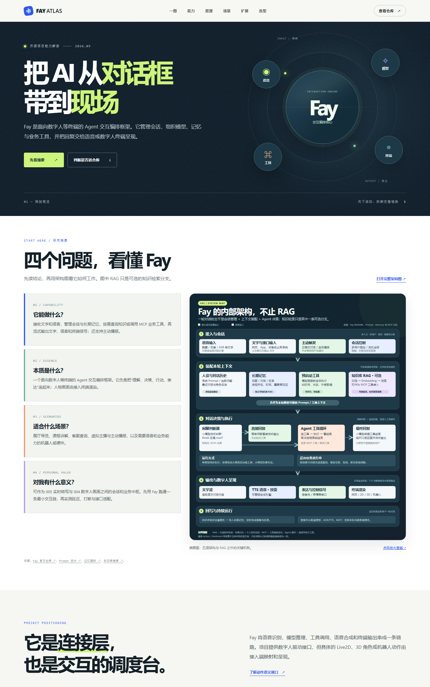

# 006 · Fay：数字人交互与业务连接框架

> Fay 的核心是面向数字人等终端的 Agent 交互编排：组织会话、模型、记忆与业务工具，再把文字、语音和控制信号交给终端。

## 基本信息

- 原仓库：[xszyou/Fay](https://github.com/xszyou/Fay)
- 作者 / 组织：xszyou
- 研究日期：2026-09-25
- 项目类型：Python 数字人 / Agent 应用框架
- 在线网页：[Fay 研究摘要与架构图](https://yydshly.github.io/0925_codex_project/projects/006-fay/)
- 上游代码许可：[GPL-3.0](https://github.com/xszyou/Fay/blob/main/LICENSE)

## 研究摘要

| 问题 | 结论 |
| --- | --- |
| **能力是什么？** | 接收文字与语音，管理多用户会话、长期记忆和主动播报；按需查询知识或调用 MCP 业务工具，流式输出文字、语音及终端信号。ASR、TTS 和模型接入可替换。 |
| **本质是什么？** | 面向数字人等终端的 Agent 交互编排框架，负责将理解、决策、行动和表达连成一条链。人物画面与具体动作由接入终端渲染。知识库 RAG 只是可选分支。 |
| **使用场景是什么？** | 展厅与场馆导览、课程讲解、客服和业务查询、虚拟主播或主动播报、需要语音交互的机器人与硬件。 |
| **对我的意义是什么？** | 可作为 005 WhisperLiveKit 实时转写与 004 LiveTalking 数字人画面之间的会话和业务中枢；先用 Fay 自带接入跑通最小链路，再实测延迟、打断和接口适配，决定是否组合现有项目。 |

依据：[Fay README](https://github.com/xszyou/Fay)、[Prompt 设计文档](https://github.com/xszyou/Fay/blob/main/docs/Prompt%E8%AE%BE%E8%AE%A1%E6%96%87%E6%A1%A3.md)、[记忆模块说明](https://github.com/xszyou/Fay/blob/main/docs/memory_module.md)、[MCP 知识库指南](https://github.com/xszyou/Fay/blob/main/docs/Fay%E6%95%B0%E5%AD%97%E4%BA%BAMCP%E7%9F%A5%E8%AF%86%E5%BA%93%E9%85%8D%E7%BD%AE%E6%8C%87%E5%8D%97.md)。

## 摘要图

图：Fay 的五层交互架构。长期记忆、预启动、业务工具和后台任务分别承担不同职责；RAG 只是按需接入的知识检索。[打开完整大图](../../docs/projects/006-fay/assets/fay-internal-architecture.svg)

## 网页预览

网页摘要区预览。移动版见 [手机布局](assets/preview-mobile.png)。

## 主要能力

| 环节 | 已有能力 | 需要按项目确认的事项 |
| --- | --- | --- |
| 输入 | 文字与语音输入、ASR 接入、唤醒与打断 | 麦克风和噪声环境下的识别质量 |
| 认知 | 人设、模型接入、工具决策、记忆与知识检索 | 选定模型的准确率、响应速度和成本 |
| 行动 | MCP 工具管理与调用、预启动工具 | 业务工具权限、参数校验和失败恢复 |
| 输出 | 流式文字、TTS、音频与数字人驱动接口 | 终端渲染、音画同步和首句等待时间 |
| 服务 | 多用户、自动播报、本机与服务端模式 | 真实部署条件下的并发和稳定性 |

## 底层技术原理

完整流程见上方[摘要图](../../docs/projects/006-fay/assets/fay-internal-architecture.svg)。

项目文档描述了“闲聊判断器 + 工具循环 + 最终回复”的流程。双模型模式中，小模型负责面向用户的流式判断与回复，大模型可在后台执行工具循环；单模型模式使用一个模型完成这些步骤。工具任务通过结构化结果决定继续调用还是结束。[来源：Prompt 设计文档](https://github.com/xszyou/Fay/blob/main/docs/Prompt%E8%AE%BE%E8%AE%A1%E6%96%87%E6%A1%A3.md)

知识库可由独立 MCP 服务提供。预启动工具在模型生成前运行，检索结果注入上下文；也可通过 HTTP 接口单独调用。记忆模块把观察、对话、反思记为节点，检索时组合相关性、时间和重要度。[来源：MCP 知识库指南](https://github.com/xszyou/Fay/blob/main/docs/Fay%E6%95%B0%E5%AD%97%E4%BA%BAMCP%E7%9F%A5%E8%AF%86%E5%BA%93%E9%85%8D%E7%BD%AE%E6%8C%87%E5%8D%97.md)、[记忆模块说明](https://github.com/xszyou/Fay/blob/main/docs/memory_module.md)

### RAG 之外的关键机制

- **长期记忆：** 记录观察、对话和反思，按相关性、时间与重要度召回；对话后异步评估记忆价值，定时生成用户画像和反思。
- **预启动工具：** 模型推理前自动获取时间、用户状态或外部资料；知识库查询只是其中一种用法。
- **业务工具与 Agent 循环：** 模型选择 MCP 工具、执行并读取结果，直到任务完成。
- **任务状态：** 双模型模式可在后台执行工具任务；用户插话时可区分进度查询、修改或取消任务等意图。
- **主动交互：** 日程式对话与自动播报，无需每次都等用户发问。
- **语音和终端：** ASR、TTS、唤醒、打断、多用户和数字人驱动接口构成实时交互层。通用 Action / Sentiment 字段在仓库中以改造方案描述，不等于数字人画面由 Fay 渲染。

依据：[Fay README](https://github.com/xszyou/Fay)、[Prompt 设计文档](https://github.com/xszyou/Fay/blob/main/docs/Prompt%E8%AE%BE%E8%AE%A1%E6%96%87%E6%A1%A3.md)、[记忆模块说明](https://github.com/xszyou/Fay/blob/main/docs/memory_module.md)、[MCP 知识库指南](https://github.com/xszyou/Fay/blob/main/docs/Fay%E6%95%B0%E5%AD%97%E4%BA%BAMCP%E7%9F%A5%E8%AF%86%E5%BA%93%E9%85%8D%E7%BD%AE%E6%8C%87%E5%8D%97.md)、[动作语义改造方案](https://github.com/xszyou/Fay/blob/main/docs/Fay%E4%BE%A7%E6%A0%87%E5%87%86%E5%8A%A8%E4%BD%9C%E6%94%B9%E9%80%A0%E8%AF%B4%E6%98%8E.md)。

## 使用场景

- 展厅与场馆导览：访客语音提问，数字人结合展项资料讲解。
- 教学与培训：虚拟教师基于课程知识答疑，按日程主动播报。
- 客服与服务大厅：除常见问答，还能通过受控工具查询预约、订单或状态。
- 硬件与机器人：终端负责收音、播放和动作，Fay 负责对话与业务编排。

## 值得借鉴与可扩展方向

1. **模块可替换：** 为 ASR、TTS 和模型设置可切换的接入层，适合在不同设备和成本条件下做取舍。
2. **工具标准化：** 将业务查询与操作做成清晰的 MCP 工具，配合权限、参数校验和审计。这是产品化扩展建议。
3. **检索前置：** 对需要每轮获取实时知识的场景使用预启动工具，再评估召回质量和额外延迟。
4. **表达语义解耦：** 可按仓库中的改造方案增加通用动作语义，让终端映射为各自的动画或机器人动作。
5. **工程验证：** 在真实终端上测量首句时延、打断、并发、工具失败恢复和回答依据。

## 对现有研究的意义

此前的项目覆盖 001 RVC 换声、002 social-auto-upload 发布、003 Voicebox 听写与配音、004 LiveTalking 数字人画面、005 WhisperLiveKit 实时语音转写。Fay 适合放在它们之间，作为对话与工具编排层：

    用户讲话 → 005 实时语音转写 → 006 Fay 会话 / 知识 / 工具 → 004 数字人画面
                                          ↓                       ↘ 成片后由 002 分发
                                   003 可作为配音候选
                                   001 可按需处理已有语音声线

这是能力组合设想，不代表上述项目已经互通。Fay 自身也有 ASR 与 TTS 接入，因此与 003、005 在局部能力上重叠；是否替换或接入，应由实测效果和接口成本决定。

## 实践记录与边界

- 已完成：官方文档与代码结构研究；制作独立静态网页，包含能力搜索、交互链路、场景切换、扩展路线和项目关系。
- 尚未完成：安装并运行 Fay 本体、接入模型与数字人终端、验证跨项目接口、测量延迟及并发。
- 研究网页仅用于说明能力，打开网页不会启动 Fay 服务。
- 仓库 README 有商用相关表述，但代码许可证是 GPL-3.0。若要把修改后的软件提供给他人，应按实际分发与集成方式核对许可义务。[来源：许可证](https://github.com/xszyou/Fay/blob/main/LICENSE)、[GNU GPL FAQ](https://www.gnu.org/licenses/gpl-faq.en.html)

## 参考链接

- [原仓库](https://github.com/xszyou/Fay)
- [Prompt 设计文档](https://github.com/xszyou/Fay/blob/main/docs/Prompt%E8%AE%BE%E8%AE%A1%E6%96%87%E6%A1%A3.md)
- [MCP 外部调用接口](https://github.com/xszyou/Fay/blob/main/docs/MCP%E5%A4%96%E9%83%A8%E8%B0%83%E7%94%A8%E6%8E%A5%E5%8F%A3.md)
- [MCP 知识库配置指南](https://github.com/xszyou/Fay/blob/main/docs/Fay%E6%95%B0%E5%AD%97%E4%BA%BAMCP%E7%9F%A5%E8%AF%86%E5%BA%93%E9%85%8D%E7%BD%AE%E6%8C%87%E5%8D%97.md)
- [记忆模块说明](https://github.com/xszyou/Fay/blob/main/docs/memory_module.md)
- [标准动作改造说明](https://github.com/xszyou/Fay/blob/main/docs/Fay%E4%BE%A7%E6%A0%87%E5%87%86%E5%8A%A8%E4%BD%9C%E6%94%B9%E9%80%A0%E8%AF%B4%E6%98%8E.md)
