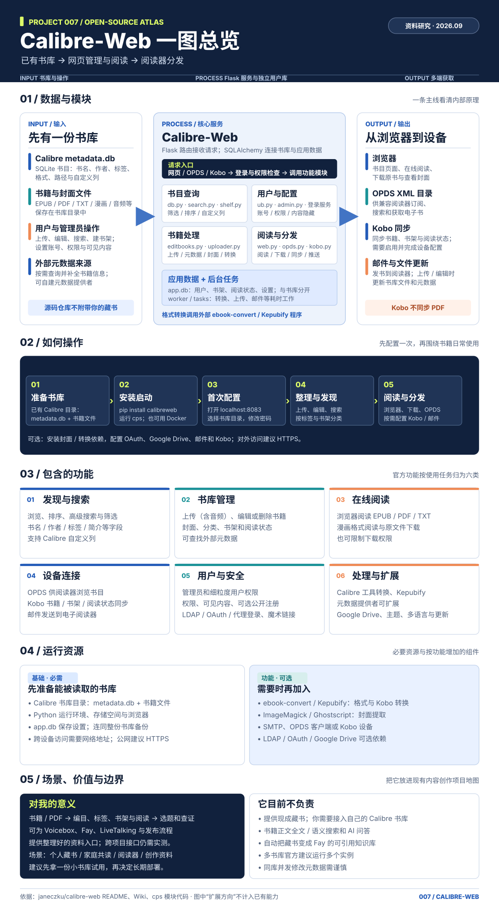

# 007 · Calibre-Web

> **一句话理解：Calibre-Web 是自托管的图书管理库。**它接入你已有的 Calibre 书库，提供编目、搜索、网页阅读、下载、阅读器供书和多用户管理；仓库提供软件，不附带书籍。对当前项目地图，它适合作为长期资料入口；正文检索与 AI 问答需要另建处理链路。

## 基本信息

- 原仓库：[janeczku/calibre-web](https://github.com/janeczku/calibre-web)
- 作者 / 组织：janeczku 与社区贡献者
- 研究日期：2026-09-25
- 项目类型：Python 自托管电子书网页应用
- Web 展示：[Calibre-Web 能力与资源地图](../../docs/projects/007-calibre-web/index.html)
- 许可证：[GPL-3.0](https://github.com/janeczku/calibre-web/blob/master/LICENSE)

## 一图总览

图：我们生成的引导图。从 Calibre 书库输入，经 Calibre-Web 内部模块，到网页、OPDS、Kobo 与邮件输出；下方补充操作步骤、功能、资源、使用场景和个人价值。依据项目官方 README、Wiki 与 cps 代码绘制。

## 一句话理解

Calibre-Web 读取一个有效的 Calibre 书库：`metadata.db` 保存书籍元数据，书库目录保存电子书文件；它另用 `app.db` 保存账号、书架、阅读状态和配置，并通过网页、OPDS 与 Kobo 接口提供访问。它是资料的管理与分发入口，不是现成的书籍正文语义检索或 RAG 系统。

## 已有能力

| 能力域 | 仓库现有能力 | 使用条件或边界 |
| --- | --- | --- |
| 发现与整理 | 书目浏览、高级搜索、筛选、书架、元数据编辑、Calibre 自定义列 | 搜索主要针对书目元数据；正文级搜索需另建索引 |
| 阅读与获取 | 浏览器阅读多种格式、上传、下载、发送到电子阅读器 | 不同格式的阅读支持和设备兼容性不同 |
| 设备连接 | OPDS 目录、Kobo 书库与阅读状态同步 | Kobo 功能需额外依赖与设置；PDF 不参与 Kobo 同步 |
| 多用户管理 | 管理员、细粒度权限、内容隐藏、公开注册选项 | 对外开放时应设置账号、HTTPS 与访问策略 |
| 身份集成 | LDAP、Google / GitHub OAuth、代理认证 | 按需安装可选依赖并配置外部服务 |
| 元数据与转换 | 外部元数据提供者、自定义提供者、格式转换 | 转换需要 Calibre `ebook-convert` 等外部程序 |

依据：[README 功能列表](https://github.com/janeczku/calibre-web#features)、[Wiki 展示与阅读器](https://github.com/janeczku/calibre-web/wiki)、[搜索实现](https://github.com/janeczku/calibre-web/blob/master/cps/search.py)、[Kobo 集成](https://github.com/janeczku/calibre-web/wiki/Kobo-Integration)。

## 实现原理

1. **书库层：** 一个 Calibre 书库由目录中的电子书文件和 SQLite `metadata.db` 构成。Calibre-Web 必须先连接有效的书库目录。[Calibre 官方 FAQ](https://manual.calibre-ebook.com/faq.html)、[Calibre-Web 数据库代码](https://github.com/janeczku/calibre-web/blob/master/cps/db.py)
2. **应用层：** Flask 处理网页和路由；SQLAlchemy 映射、查询书目与应用数据。`app.db` 保存用户、书架、阅读状态及配置。[应用初始化](https://github.com/janeczku/calibre-web/blob/master/cps/__init__.py)、[用户数据模型](https://github.com/janeczku/calibre-web/blob/master/cps/ub.py)
3. **分发层：** 网页供浏览器访问；`/opds` 输出目录给兼容阅读器；Kobo 路由处理设备同步、封面与下载。[OPDS 代码](https://github.com/janeczku/calibre-web/blob/master/cps/opds.py)、[Kobo 代码](https://github.com/janeczku/calibre-web/blob/master/cps/kobo.py)
4. **可选处理：** 转换任务调用本机 Calibre 或 Kepubify 程序；元数据提供者可按开发文档增加。[转换任务](https://github.com/janeczku/calibre-web/blob/master/cps/tasks/convert.py)、[开发者文档](https://github.com/janeczku/calibre-web/wiki/Developer's-corner)

## 资源清单

### 基础运行

- 一份有效的 Calibre 书库：`metadata.db` 和书籍文件都要保留。仅有散落的 EPUB / PDF 文件还需要先建立书库。
- 可运行 Python 的设备与存储空间；官方 README 写明 Python 3.7 或更新版本，并提供 pip 安装方式。
- Calibre-Web 自己的 `app.db`。备份时应同时保存完整书库与这个配置数据库。
- 浏览器；若供手机、平板或异地使用，还需要可访问的网络地址。对外访问应配置 HTTPS。

### 按功能增加

- **封面提取：** ImageMagick；在 Windows 提取 PDF 封面可能还需要 Ghostscript。
- **格式转换：** Calibre 桌面程序提供的 `ebook-convert` 二进制文件；Kobo 的 KEPUB 转换可使用 Kepubify。
- **身份与存储集成：** LDAP、OAuth、Google Drive 等功能各有可选 Python 依赖及服务配置。
- **阅读器连接：** OPDS 兼容客户端，或按官方指南配置的 Kobo 设备。
- **邮件推书：** 邮件服务及阅读器接收邮箱配置。

依据：[安装与环境要求](https://github.com/janeczku/calibre-web#requirements)、[可选依赖](https://github.com/janeczku/calibre-web/blob/master/optional-requirements.txt)、[设置备份](https://github.com/janeczku/calibre-web/wiki/FAQ)。

## 使用场景

1. **个人资料书库：** 将已拥有的电子书与 PDF 编目，跨设备浏览、阅读和下载。
2. **家庭或小团队共享：** 设置账号和权限，用书架组织共读资料。
3. **阅读器供书：** 用 OPDS 连接阅读器，或按兼容范围配置 Kobo 同步。
4. **内容创作的资料管理：** 把长期使用的书籍和参考资料统一整理，供选题、查证和撰稿时查找。

## 对我的意义：放进现有项目地图

现有 001–006 项目覆盖换声、口述与配音、数字人、实时转写、多平台发布以及对话编排。007 可以补上**长期参考资料的整理入口**：先用 Calibre-Web 管理书籍、作者、标签、阅读状态和书架，再由人选取可靠资料进入内容生产。它与 [003 Voicebox](../003-voicebox/README.md) 的口述和配音、[006 Fay](../006-fay/README.md) 的交互、[002 social-auto-upload](../002-social-auto-upload/README.md) 的发布可形成工作流设想；这些项目之间尚无经验证的现成集成。

如果目标是“让 Fay 回答整本书的问题”，Calibre-Web 只能提供书库与文件入口。还需要合法获取文本、解析与切分、建立全文或向量索引、检索时返回来源，并评估引用准确性。这属于下一阶段的独立开发，不应计入当前仓库能力。

**采用建议：** 已有几十本以上可反复查阅的电子书，值得用一份小书库试用；如果只有零散几份文件，先完成资料目录和使用习惯，暂不需要部署服务。

## 可扩展方向（建议，非当前功能）

1. **中文元数据质量：** 借助自定义元数据提供者改善匹配、清洗和去重；仓库已有豆瓣提供者示例。
2. **资料处理流水线：** 统一上传、命名、标签、来源记录与格式转换。
3. **正文检索与引用：** 解析 EPUB / PDF，建立全文索引，返回章节和页码级来源。
4. **AI 阅读辅助：** 在可靠检索之后再加入摘要、问答、主题关联与笔记；须明确权限和可追溯性。
5. **多书库聚合：** 官方 FAQ 建议多个书库运行多个实例；统一入口需要额外架构设计。

## 采用边界与实践记录

- 官方 FAQ 提醒：Calibre 桌面端和 Calibre-Web 同时修改书目元数据可能导致不可预期结果。先决定主要的编辑入口。[FAQ](https://github.com/janeczku/calibre-web/wiki/FAQ)
- Kobo 集成文档列出大型书库同步超时的已知问题，且 PDF 不同步；要用自己的设备和书库验证。[Kobo 集成](https://github.com/janeczku/calibre-web/wiki/Kobo-Integration)
- 官方快速开始仍列出默认管理员凭据 `admin / admin123`；实例对外开放前必须更改。[快速开始](https://github.com/janeczku/calibre-web#quick-start)
- 本次完成的是官方资料与代码结构研究、静态展示网页，未在本机部署 Calibre-Web，也未实测设备同步或跨项目接口。

## 参考链接

- [项目 README](https://github.com/janeczku/calibre-web)
- [Calibre-Web Wiki](https://github.com/janeczku/calibre-web/wiki)
- [Calibre 官方 FAQ：书库结构](https://manual.calibre-ebook.com/faq.html)
- [开发者文档：元数据提供者](https://github.com/janeczku/calibre-web/wiki/Developer's-corner)
- [Kobo 集成说明](https://github.com/janeczku/calibre-web/wiki/Kobo-Integration)
- [GPL-3.0 许可证](https://github.com/janeczku/calibre-web/blob/master/LICENSE)
