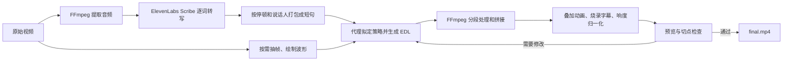

# 008 · video-use 能力地图

## 基本信息

- 原仓库：https://github.com/browser-use/video-use
- 作者 / 组织：browser-use
- 研究日期：2026-09-25
- 项目类型：代码代理 Skill 与视频剪辑辅助脚本
- Web 演示：[静态网页](../../docs/projects/008-video-use/index.html)；部署后地址：https://yydshly.github.io/0925_codex_project/projects/008-video-use/

## 研究动机

当前仓库已研究语音输入、配音、数字人出镜与多平台发布。video-use 位于“素材录好之后、内容发布之前”的剪辑环节，值得评估它是否能减少个人 IP 视频的重复粗剪工作。

## 研究摘要

video-use 用 ElevenLabs Scribe 把音频识别成带逐词时间戳的文本，压缩为短句供代码代理理解内容、选择片段并生成 EDL；Python/FFmpeg 据此同步裁剪音画、添加字幕等效果并渲染。它适合口播、访谈、教程和产品讲解。语音时间对齐不保证画面连续，切点跳变、识别错误、云转写依赖及中文/Windows 兼容性都需要实测和审片。对我们，它有望补上 Voicebox / LiveTalking 素材到 social-auto-upload 发布之间的剪辑环节。

> 核对日期：2026-09-25。内容基于仓库 `main` 分支的 README、`SKILL.md`、安装说明及 `helpers/` 源码；尚未用真实素材运行端到端剪辑。上游代码变化后应重新核对。

## 一句话定位

video-use 是供 Claude Code、Codex 等具备命令行能力的代理使用的**对话式视频剪辑 Skill + Python/FFmpeg 脚本集合**。它把音频转写变成代理的主要阅读界面，让代理生成剪辑决策表（EDL），再由脚本渲染视频。它本身没有独立的剪辑 GUI，也没有自研的语音识别或视频生成模型。

## 模型与运行位置

剪辑判断由接入的代码代理及其大模型完成；video-use 不附带通用大模型权重或专属模型服务器。现成的转写脚本会把音频上传到 ElevenLabs Scribe，音视频脚本则在代理能执行命令的环境运行。模型是否在本地取决于所选代理，原版转写仍需联网。

网页中的 12 张能力卡梳理主要能力域，不是所有参数、制作技巧或 browser-use 其他产品的全集。

## 隐藏问题与质量边界

- **时间对齐不等于画面连续。** FFmpeg 按同一时间戳裁剪音画，仍可能让人物姿态、手势、镜头或屏幕内容在相邻片段间突然跳变；需要逐切点预览、调整 EDL 或补充画面。
- **识别结果会传导到剪辑。** 错词、错说话人或时间戳偏差可能导致选段和字幕出错，关键句与切点需人工核对。
- **现成方案有云服务和环境依赖。** 原版转写上传音频到 ElevenLabs；中文识别、字幕与 Windows 运行尚未用真实素材验证。

## 从素材到成片

**关键边界：**“挑选最佳片段”“理解叙事”“检查成片”等依赖代理按 `SKILL.md` 执行；转写、打包、时间线图片、渲染和基础调色有实际脚本支持。使用者需要确认剪辑策略，并对最终成片负责。

## 阅读顺序

1. [能力清单](docs/capabilities.md)：逐项区分现成脚本、代理工作流程及边界。
2. [技术原理](docs/architecture.md)：数据流、关键文件、实现细节与限制。
3. [价值与扩展](docs/adoption.md)：适用场景、试点评估、优先扩展方向。
4. [核对来源](docs/sources.md)：对应的上游文件及核对方法。

## 快速判断

| 素材或需求 | 适配度 | 原因 |
| --- | --- | --- |
| 多条口播、访谈、教程、产品讲解 | 高 | 逐词转写能直接支撑内容挑选和切点定位 |
| 有旁白的产品演示或屏幕录制 | 较高 | 可按讲述组织内容，并配动画或字幕；仍需核对画面 |
| 音乐、运动、旅行等少对白素材 | 有条件 | 现有主索引是语音；画面理解主要依赖按需抽样 |
| 要求离线处理或敏感音频不上云 | 需要改造 | 默认转写会把提取的音频上传到 ElevenLabs |

## 本子项目范围

这里是**能力整理与采用评估**，没有复制上游仓库、安装依赖或调用转写 API。若进入试点，先选一组真实素材做完整剪辑，再记录人工修正时间、错词、切点、字幕与画面问题。

## 值得借鉴的做法

1. **用结构化文本代表长视频。** 逐词时间戳和短句表让代理先看内容，只在需要时查看画面，适合多条口播选优。
2. **用 EDL 分离决策与执行。** 剪辑内容可以先审阅，再重复渲染为不同版本。
3. **把质量检查放进工作流程。** 切点、字幕、音量和画面应在交付前检查；这仍需真实素材验证。

## 图片与说明

图 1：根据上游 README、Skill 与脚本整理的总览图。橙色是代理流程，绿色是仓库脚本，紫色是外部工具；Voicebox / LiveTalking 与 social-auto-upload 的衔接是待验证设想。也可在[能力网页中查看](../../docs/projects/008-video-use/index.html#overview)。

## 实践记录

已阅读上游 README、Skill 和主要辅助脚本，整理了能力、架构、采用条件与扩展清单，并制作可筛选的静态网页；尚未安装上游项目或用真实素材运行。

## 结论与后续

- **已确认：** 逐词转写、短句打包、局部画面概览、EDL 渲染、字幕、基础调色与响度处理均有脚本实现。
- **仍需验证：** 中文识别与字幕效果、Windows 字体和路径兼容性、实际剪辑质量、API 成本及端到端耗时。
- **可用于自己的项目：** 003 Voicebox 或 004 LiveTalking 产出的讲述素材可进入 video-use 剪辑；成片可交给 002 social-auto-upload 发布。这是待实测的工作流衔接，并非现成集成。

## 参考链接

- [上游仓库](https://github.com/browser-use/video-use)
- [源码核对清单](docs/sources.md)
