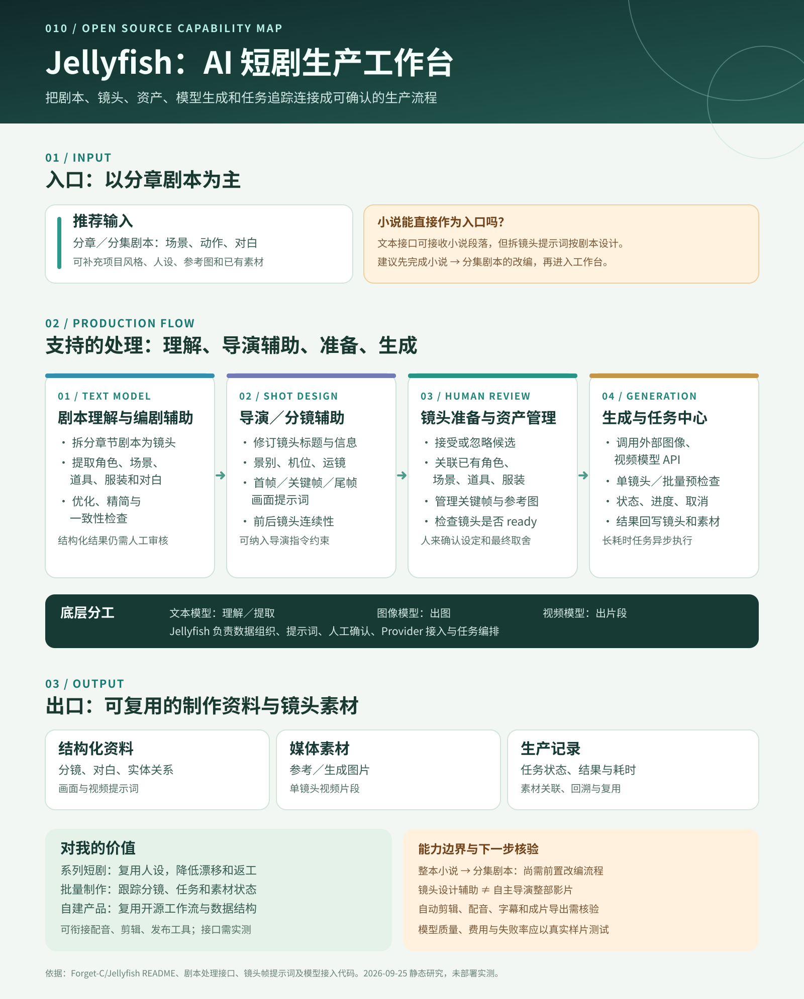

# 010 · Jellyfish：AI 短剧生产工作台

> **研究摘要：** Jellyfish 以分章剧本为主要入口，把剧本拆解、分镜与导演提示、角色和场景资产复用、人工确认、图片与视频模型调用、异步任务追踪接成一套短剧生产流程。主要出口是可追溯的分镜数据、提示词、图片和单镜头视频素材。完整小说改编与自动剪辑成片不能仅凭现有功能说明视为已验证能力。

## 基本信息

- 原仓库：[Forget-C/Jellyfish](https://github.com/Forget-C/Jellyfish)
- 作者 / 组织：Forget-C
- 研究日期：2026-09-25
- 项目类型：开源 AI 短剧生产工作台，Apache-2.0
- [在线图文导读](https://yydshly.github.io/0925_codex_project/projects/010-jellyfish/) · [完整引导图](../../docs/projects/010-jellyfish/assets/overview.svg)

## 一句话定位

它把**剧本到镜头素材**的生产步骤组织起来：文本模型理解剧本，创作者确认分镜和实体资产，图像 / 视频模型生成画面，工作台保存上下文并追踪任务。Jellyfish 自身主要提供流程、数据模型和模型接入层，而不是一个包揽编剧、导演、拍摄和剪辑的单体模型。

## 输入是什么

1. **核心输入：分章或分集的剧本文本。** 拆镜头接口接收 `script_text`，代码将其描述为“完整剧本文本”，并要求输出镜头序号、起止行、剧本摘录、镜头名称和时间等结构化字段。
2. **制作上下文：** 项目风格、角色 / 场景 / 道具 / 服装设定，以及可上传、关联和复用的参考图片或已有素材。
3. **运行配置：** 文本、图像、视频模型及相应 Provider 的 API 凭据。没有可用的模型服务，工作台不能独立生成相应内容。

**小说作为输入的边界：** 文本字段可以接收小说段落，但拆镜头提示词以“剧本”为对象。仓库提供剧本优化和精简，却未在已核对的主流程中明确提供“整本小说 → 分集规划 → 戏剧化改编 → 完整剧本”的闭环。实用路径是先把小说改编为分集剧本，再导入 Jellyfish。

## 支持哪些处理

| 环节 | 已说明或可在代码中看到的能力 | 人的作用 |
| --- | --- | --- |
| 剧本理解与编剧辅助 | 拆成镜头；提取角色、场景、道具、服装、对白；剧本优化、精简、一致性检查与专项分析 | 审核情节、对白、角色归属与模型提取结果 |
| 导演与分镜辅助 | 修订镜头信息；结合景别、机位、运镜、氛围、相邻镜头信息生成首帧、关键帧、尾帧提示词；可纳入导演指令摘要 | 决定镜头节奏、画面取舍和最终表达 |
| 镜头准备与资产一致性 | 接受、忽略或关联候选资产和对白；管理角色、演员、场景、道具、服装及参考图；判断镜头是否 `ready` | 确认人设和素材，处理跨镜头冲突 |
| 图像 / 视频生成 | 预览视频提示词、管理关键帧与参考图；单镜头或批量预检查；调用外部图像 / 视频模型 | 选择模型和结果，审片、返工 |
| 生产任务管理 | 文本、图像、视频异步任务；查看状态、进度、结果和耗时；取消任务并关联回项目 / 章节 / 镜头 | 控制成本和排期，处理失败任务 |

这里的“导演”是**镜头级设计辅助**。帧提示词代码会考虑景别、机位、运镜、构图、视线、动作拍点及前后镜头承接，也接受导演指令摘要；这不等于系统自主完成整部影片的导演决策。

## 输出是什么

- **结构化制作资料：** 章节镜头、剧本摘录、对白、实体关系、候选确认结果、首 / 关键 / 尾帧与视频提示词。
- **媒体素材：** 上传或生成的图片、关键帧 / 参考图，以及关联到镜头的生成视频片段。
- **过程记录：** 生成任务状态、结果和耗时；可从任务返回对应的项目、章节、镜头，并复用已有素材。

仓库介绍文字提到“后期剪辑、一键导出成片”，但当前详细能力清单主要落在镜头级生成和素材回写。**完整成片导出应作为试用时重点核验的环节**，不能把单镜头视频输出直接等同于一部已剪辑完成的短剧。

## 底层原理

```text
剧本文本 → 文本模型按提示词提取结构化信息 → 人工确认并写入项目 / 镜头 / 实体数据
         → 汇合设定、参考图和导演约束 → 调用外部图片 / 视频模型
         → 异步任务追踪 → 结果回写镜头与素材库
```

后端使用 FastAPI、SQLAlchemy、Pydantic 与 LangChain 系列依赖；例如拆镜头 Agent 用提示词让文本模型输出 JSON，再归一化并校验为固定结构。前端使用 React、TypeScript、Vite。长耗时任务通过 Celery / Redis 执行，Docker Compose 方案包括 MySQL 和 S3 兼容的 RustFS。Provider 注册和适配代码使文本、图像、视频模型可分别配置。它没有随仓库提供自研基础视频模型，画面质量、速度与费用依赖实际接入的服务。

## 对我的价值与适用场景

- **连续短剧和多镜头内容：** 统一维护人物、场景及参考图，减少重复设定和跨镜头漂移；镜头仍需审查。
- **小团队或批量制作：** 让分镜准备、候选确认、生成和返工有状态、有上下文，便于定位耗时和失败点。
- **现有内容工作流：** 可探索将 Jellyfish 放在剧本和镜头素材环节；生成的片段再交给 [008 video-use](../008-video-use/README.md) 等剪辑工具处理，成片经 [002 social-auto-upload](../002-social-auto-upload/README.md) 分发。[003 Voicebox](../003-voicebox/README.md) 可作为配音候选。以上跨项目接口尚未实测。
- **产品开发：** 可借鉴其项目 / 镜头 / 实体数据模型、人工确认机制、Provider 适配和任务回写，而不必从零设计生产工作台。

如果只是偶尔生成单条短视频，部署和模型配置的成本可能大于流程收益。最合适的验证是拿一段真实剧本做 6–10 个镜头的小样，记录分镜修正次数、角色一致性、每镜头生成费用、失败重试和最终剪辑耗时。

## 图片与说明



图 1：我们依据上游 README、剧本处理接口、帧提示词和模型接入代码制作的能力图。实线表示主要生产顺序；小说改编与完整成片标为需补足或核验的环节。这是研究整理图，不是上游产品截图。

## 可扩展方向

1. **小说改编前置流程：** 加入分集规划、人物弧线、场景与对白改编，并保留原文到剧本的出处映射。
2. **导演和质量控制：** 增加镜头节奏审查、角色形象相似度检查、场景 / 轴线连续性评估及人工审核点。
3. **后期与交付：** 配音、字幕、音乐、时间线剪辑、画幅版本和可验证的成片导出。
4. **规模化运行：** Provider 适配、成本预算、失败重试、任务优先级、团队权限和版本审计。

## 实践记录与结论

本次基于公开 README 和关键代码进行静态研究，未部署 Jellyfish，也未用真实剧本和模型完成端到端试产。

- **已确认：** 剧本拆镜头、实体与对白提取、镜头准备、资产复用、镜头级图像 / 视频任务和任务中心是仓库的明确主流程。
- **仍需验证：** 小说原文直接输入后的适配质量、可用模型组合、跨镜头视觉一致性、完整剪辑 / 成片导出与实际费用。
- **我的结论：** 优先将它视为**剧本到镜头素材的生产工作台**；有系列短剧或批量内容需求时再进行真实样片验证。

## 参考链接

- [项目 README](https://github.com/Forget-C/Jellyfish#readme)
- [中文功能说明](https://github.com/Forget-C/Jellyfish/blob/main/docs/README.zh.md)
- [剧本处理接口](https://github.com/Forget-C/Jellyfish/blob/main/backend/app/api/v1/routes/script_processing.py)
- [拆镜头 Agent](https://github.com/Forget-C/Jellyfish/blob/main/backend/app/chains/agents/script_divider_agent.py)
- [首帧 / 关键帧 / 尾帧提示词 Agent](https://github.com/Forget-C/Jellyfish/blob/main/backend/app/chains/agents/shot_frame_prompt_agents.py)
- [Provider 注册](https://github.com/Forget-C/Jellyfish/blob/main/backend/app/services/llm/provider_bootstrap.py) · [后端依赖](https://github.com/Forget-C/Jellyfish/blob/main/backend/pyproject.toml) · [部署编排](https://github.com/Forget-C/Jellyfish/blob/main/deploy/compose/docker-compose.yml)
