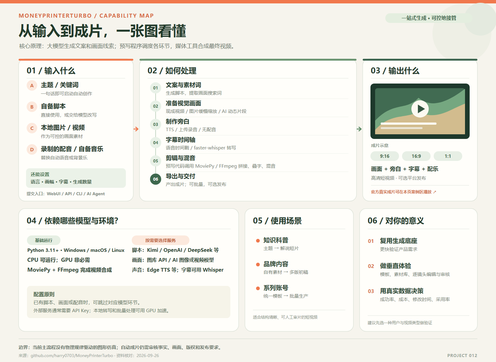

# 012 · MoneyPrinterTurbo

> 输入主题、脚本或自有素材，由大模型生成文案与画面线索，再用现成视频、图片动画或可选视频模型准备镜头，最后由程序合成短视频。适合内容初稿与批量制作，可作为自有产品的生成底座。

## 基本信息

- 原仓库：[harry0703/MoneyPrinterTurbo](https://github.com/harry0703/MoneyPrinterTurbo)
- 作者 / 组织：Harry / harry0703
- 研究日期：2026-09-26
- 项目类型：Python 开源应用，MIT 许可
- Web 展示：[MoneyPrinterTurbo 能力、原理与真实案例](../../docs/projects/012-moneyprinterturbo/index.html)
- 在线网页：https://yydshly.github.io/0925_codex_project/projects/012-moneyprinterturbo/

## 研究摘要

| 问题 | 我们的理解 |
| --- | --- |
| 它的能力是什么？ | 从主题、关键词或自备脚本与素材出发，自动准备文案、镜头、配音、字幕、配乐并合成短视频；支持 WebUI、API、CLI、Agent 和批量任务。 |
| 技术原理是什么？ | 大模型生成脚本与素材搜索词；画面可来自图库或自有视频、静态图片加程序化缩放，或外部视频模型生成的动态短片段；TTS / 转写提供声音与字幕，MoviePy / FFmpeg 完成剪辑合成。模型不会在运行时替项目编写整条视频的程序。 |
| 使用场景是什么？ | 知识科普、品牌或门店内容初稿、统一格式的系列短视频；题材不限于 AI，但事实、画面贴题程度和素材授权需要审核。 |
| 对我的意义是什么？ | 复用现有成片流程，先验证一个具体人群的视频需求。若做物理逻辑等精确教学图解，应额外开发公式、参数与规则驱动的图形动画层，再把片段交给它合成。 |

具体效果、成本和速度取决于选择的模型与素材服务。本研究网页展示官方公开成片，但未本地运行 MoneyPrinterTurbo。

## 能力与原理

| 环节 | 上游实现 | 适用意义 |
| --- | --- | --- |
| 主题与脚本 | 大模型根据主题生成文案，并提炼素材搜索词；也可直接传入脚本 | 快速得到初稿，保留人工改稿入口 |
| 画面 | Pexels / Pixabay / Coverr 库存视频、本地图片和视频，或可选文生图 / 文生视频服务 | 可以在速度、原创性、成本和可控性之间选路径 |
| 声音 | Edge TTS 等配音提供商、自备配音、无配音；可选背景音乐 | 统一声音风格或使用自己的素材 |
| 字幕 | TTS 时间戳或本地 faster-whisper 转写，再叠加样式 | 自动得到可读的时间轴与成片字幕 |
| 成片 | MoviePy 与 FFmpeg 处理裁剪、拼接、音轨混合和导出 | 从片段得到竖屏、横屏或方形短视频 |
| 任务入口 | WebUI、FastAPI、CLI、Agent；任务状态可使用内存或 Redis | 便于试用，也便于接入外部工作流 |

关键流程：**主题 / 脚本 → 文案与搜索词 → 素材 → 配音与字幕 → 剪辑与混音 → 成片**。预先编写的 Python 代码调度各环节；大模型不在运行时生成程序代码。按所选素材路径，视觉片段可以来自图库、自有素材或 AI 视频模型，最终由 MoviePy / FFmpeg 合成。库存素材路径主要依靠搜索词与条件筛选；画面是否准确表达旁白，仍要预览。

### 画面运动的三种来源

- **库存或自有视频：** 原素材就是连续画面，程序按时长裁切、适配画幅并可加入转场。
- **自有照片或 AI 生图：** 先有静态图片，再由 render_image_zoom_video 以缓慢放大的方式渲染成视频片段；这不是视频模型逐帧生成动作。
- **AI 视频服务：** 项目按脚本关键词请求外部模型生成若干动态短片段，直到覆盖旁白时长，再统一剪辑合成。具体模型内部如何生成每一帧由提供商实现，MoneyPrinterTurbo 自身只接收返回的片段。

因此项目没有固定的“主画面加补帧”机制；最终运动来自素材本身、程序化缩放与转场，或可选外部视频模型。

## 使用场景

1. 知识和科普：把一个概念变成带旁白与字幕的短视频。
2. 品牌内容初稿：结合自有素材，快速得到门店、活动或商品介绍的备选版本。
3. 系列内容：统一格式后批量制作相关主题的短视频。

事实敏感内容、严格品牌要求、素材授权以及自动发布前，都需要人工审核。

## 能力边界：逻辑驱动的教学图形

题材没有被限制为“AI 模型”或技术内容。给它一个物理主题，可以得到文案、配音、字幕及相关素材构成的视频。不过当前主流程按脚本关键词获取画面、对图片做缩放、对镜头做转场和合成，没有看到将物理公式、力学参数或因果关系直接转为精确图形动画或仿真的专门模块。自动生成的视频可以辅助讲解，不能仅凭视觉效果认定物理过程正确。

若要做面向教学的产品，可新增“概念 / 公式 → 结构化参数与规则 → 图形动画或仿真片段”的渲染环节，再把片段作为本地视频素材接入 MoneyPrinterTurbo，让它继续负责配音、字幕、音乐和成片。这个方向属于基于现有架构的产品扩展建议，不是上游仓库现成的功能。

## 真实案例展示

网页中嵌入了上游仓库公开展示的 **《一杯手冲咖啡的细节》**，中文、横屏、约 23 秒。它是 MoneyPrinterTurbo 官方标注的实际生成作品，播放时从官方素材仓库加载，并提供[官方观看页](https://harry0703.github.io/mpt-assets/?video=06-zh-landscape-pour-over-coffee.mp4)作为备用入口。

网页左侧的“咖啡内容账号”任务背景与三段分镜，是本站为了说明应用方法而设计的**讲解示意**；它们不是这条官方成片的原始提示词或任务记录。本站未安装或运行 MoneyPrinterTurbo，也不调用其 API。

## 对自有产品的价值

- **可复用：** 生成脚本、找素材、配音、字幕、合成与 API。
- **需补齐：** 专属用户和团队、隔离与权限、用量与成本、稳定任务队列、存储、失败恢复、审核工作台。
- **差异化方向：** 选一类明确用户，建立其模板、素材库、逐镜头可编辑体验与质量评估。仅把上游通用流程换一个页面，产品壁垒有限。

建议先选一种视频类型，用 20 个真实题目记录成功出片率、单条成本、人工修改时间和用户采用情况，再决定优化重点。仓库采用 MIT 许可，但素材、音乐及外部模型服务须分别核对使用条件；上游 README 对自带背景音乐也有权利提示。

## 一图看懂完整能力

[查看可放大的 SVG 原图](../../docs/projects/012-moneyprinterturbo/assets/capability-map.svg)。图中将 Python 与视频合成工具列为基础环境，将脚本、画面和配音模型列为按需选择的服务，避免误以为所有模型都必须同时接入。

## 图片与说明

图：本站原创 SVG 插画，仅作网页案例氛围画面。真实生成结果是网页中链接的上游公开视频，两者不应混淆。

## 实践记录

- 完成上游 README、配置示例、任务编排、素材、字幕、视频合成、状态和许可证的阅读。
- 建立无需构建的静态展示页，包含能力、工作原理、素材来源切换、示意分镜切换与官方真实视频播放。
- 保持页面资源为相对路径，适配仓库现有 GitHub Pages 子路径。
- 尚未配置上游 API Key 或实测本地视频生成，因此网页不展示成本、速度或质量的实测数据。

## 参考链接

- [上游 README 与作品展示](https://github.com/harry0703/MoneyPrinterTurbo)
- [任务编排](https://github.com/harry0703/MoneyPrinterTurbo/blob/main/app/services/task.py)
- [素材处理](https://github.com/harry0703/MoneyPrinterTurbo/blob/main/app/services/material.py)
- [字幕处理](https://github.com/harry0703/MoneyPrinterTurbo/blob/main/app/services/subtitle.py)
- [视频合成](https://github.com/harry0703/MoneyPrinterTurbo/blob/main/app/services/video.py)
- [配置示例](https://github.com/harry0703/MoneyPrinterTurbo/blob/main/config.example.toml)
- [MIT 许可证](https://github.com/harry0703/MoneyPrinterTurbo/blob/main/LICENSE)
- [官方作品素材仓库](https://github.com/harry0703/mpt-assets)
